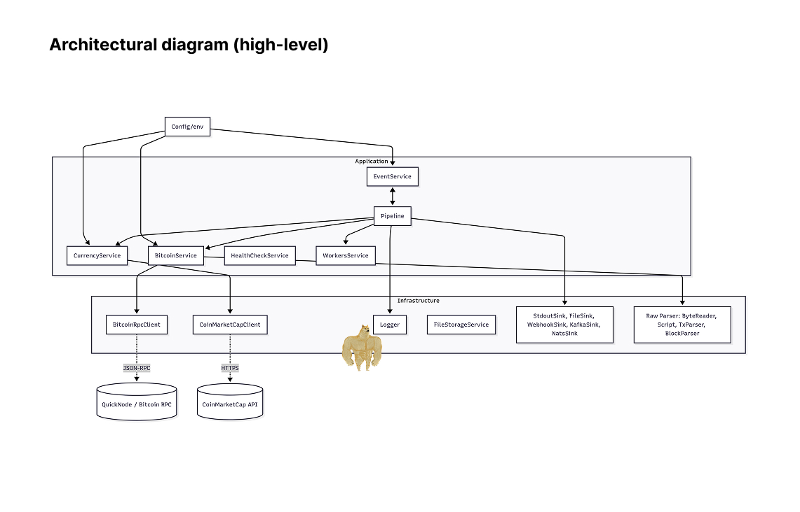
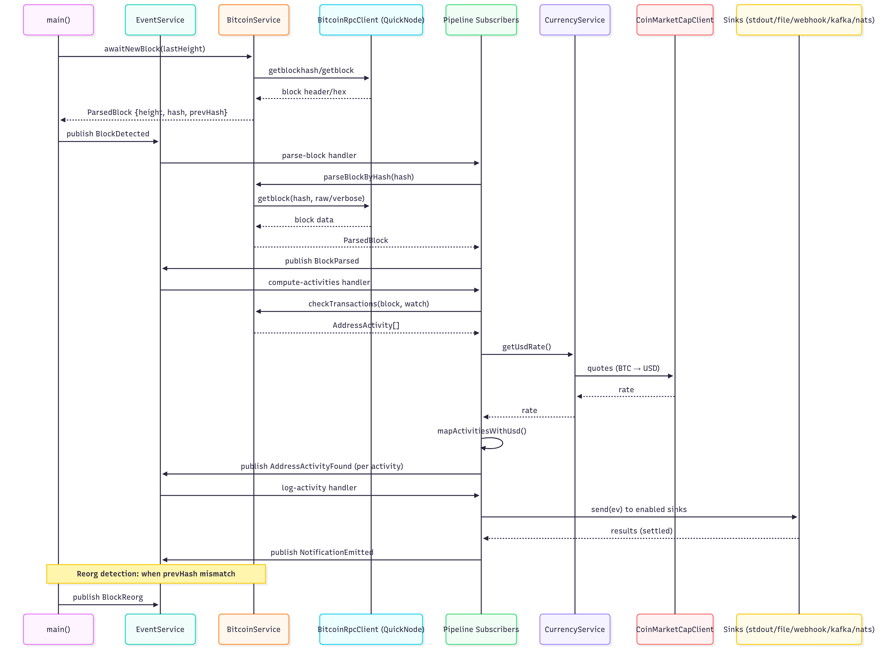

# BTC Transaction‑scanner Bot

This is a short overview of the solution. A full guide lives in [docs/README_FULL.md](docs/README_FULL.md).

## Quick start (deploy & test first)

```bash
# 1) Setup
bun install
cp .env.scripts .env || true
echo "APP_ENV=development" >> .env
echo "BTC_RPC_API_URL=https://rpc-alias.btc-testnet.quiknode.pro/your-id" >> .env

# Optional (USD amounts):
# echo "API_KEY_COINMARKETCAP=your_key" >> .env

# 2) Create addresses.json at project root (gitignored)
cat > addresses.json << 'JSON'
[
  { "address": "bc1qexampleaddressxxxxxxxxxxxxxxxxxxxxxx", "label": "wallet-1" }
]
JSON

# 3) Run
bun run start

# 4) Tests (pretty metrics summary)
bun run test
```

Docker/Compose and full instructions are in [docs/README_FULL.md](docs/README_FULL.md).

## Architecture at a glance





Details: [docs/ARCHITECTURAL_RUNBOOK.md](docs/ARCHITECTURAL_RUNBOOK.md) (sequence + services), [docs/EVENTS.md](docs/EVENTS.md) (versioned domain events and JSON samples).

## Alignment with requirements

- System design
  - Event‑driven pipeline with explicit domain events: `BlockDetected → BlockParsed → AddressActivityFound → NotificationEmitted`. Reorgs emit `BlockReorg`.
  - Backpressure, bounded queues, per‑handler concurrency, retry/backoff.
- Transaction notifications (stdout JSON)
  - Each watched activity is logged as structured JSON; includes BTC and optional USD equity.
  - Mixed in/out within a single tx are netted and emitted once with absolute net value.
- Raw data processing (no explorers)
  - Direct Bitcoin Core RPC via `BitcoinRpcClient` (QuickNode compatible).
  - Optional raw path (`PARSE_RAW_BLOCKS=true`): custom zero‑copy parser for blocks/tx/scripts; OP_RETURN extraction with safe UTF‑8.
- Performance & scalability targets
  - Latency target ≤ 5s from block discovery; tests validate end‑to‑end latency and throughput.
  - ≥1000 watched addresses; sustained 7 TPS supported; backpressure protects steady‑state.
- Restrictions
  - No blockchain explorer APIs; all data comes from RPC endpoints.

See [docs/EVENTS.md](docs/EVENTS.md) for domain event schemas with `dedupeKey`/`eventId` idempotency.

## Key engineering decisions

- Event bus + explicit pipeline: composable flow, clear boundaries, easy testing.
- At‑least‑once delivery with deterministic `dedupeKey` per event type.
- Horizontal scale via `WorkersService` (Rendezvous hashing) to partition watched addresses.
- Pluggable sinks: stdout (default), file, webhook, Kafka, NATS (config‑driven).
- Feature flags (`parseRawBlocks`, `resolveInputAddresses`) with optional runtime hot‑reload file.
- HTTP keep‑alive and per‑host connection pools for RPC and currency providers.

## Optimizations (highlights)

- Zero‑copy raw parsing: avoid hex/string materialization, slice‑based readers, fast `toHexLE`.
- Reduced allocations in Tx parsing and Base58/Bech32 encoding paths.
- Batching + small LRU for prev‑tx lookups when resolving inputs.
- Cached watch structures for fast per‑block matching.

Details: [docs/OPTIMIZATIONS.md](docs/OPTIMIZATIONS.md).

## Documentation

- Full README: [docs/README_FULL.md](docs/README_FULL.md)
- Architectural runbook: [docs/ARCHITECTURAL_RUNBOOK.md](docs/ARCHITECTURAL_RUNBOOK.md)
- Domain events and JSON examples: [docs/EVENTS.md](docs/EVENTS.md)
- Raw parser design: [docs/BTC_RAW_PARSER.md](docs/BTC_RAW_PARSER.md)
- Logger guide: [docs/LOGGER.md](docs/LOGGER.md)