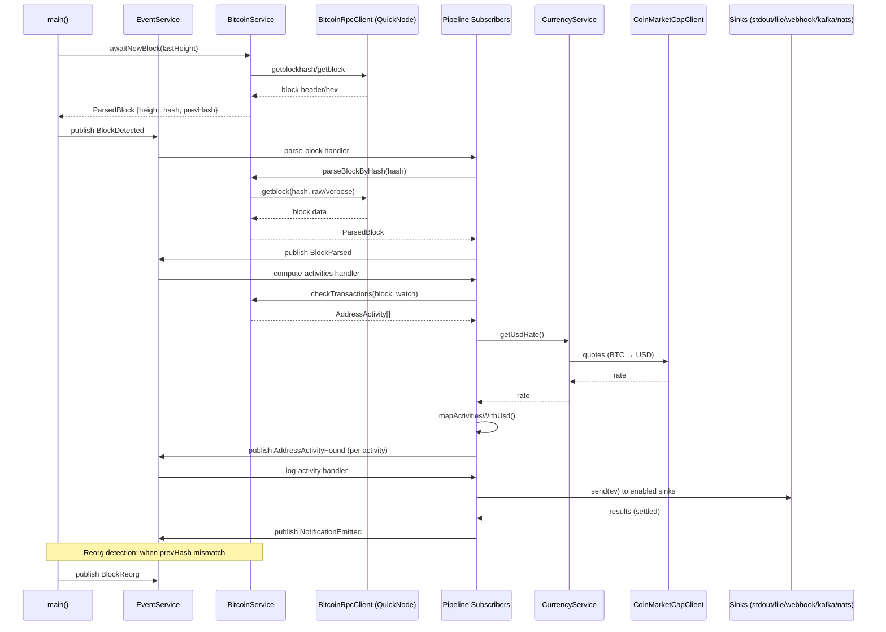
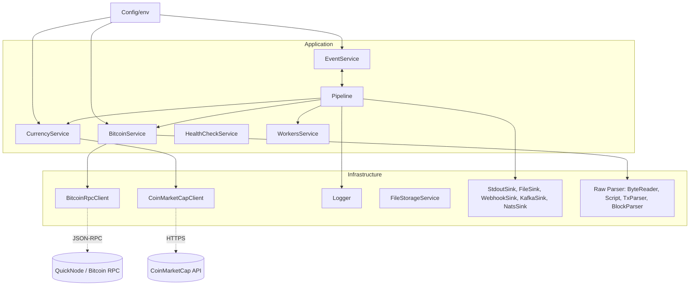

## Architectural Runbook

This document explains how a Bitcoin block flows through the system and how services interact with infrastructure and external providers.

### Block flow (sequence)

Key notes:

- Timestamps are ISO-8601 strings on events; `block.time` is UNIX seconds.
- Backpressure uses the event bus queue; parsing and OP_RETURN logging may be delayed when backlog is high.
- Each event includes a deterministic `dedupeKey` and optional canonical `eventId`.

### Services diagram

### Event flow summary

- BlockDetected → BlockParsed → AddressActivityFound → NotificationEmitted
- BlockReorg is emitted on chain rollbacks (height, old/new hashes) for compensating actions downstream.

### Operational considerations

- Horizontal scaling via `WorkersService` partitions watchlists by Rendezvous hashing.
- Sinks are pluggable; default is stdout. File/webhook/Kafka/NATS can be enabled via config.
- Feature flags: `parseRawBlocks`, `resolveInputAddresses` are centralized and hot-reloadable.

